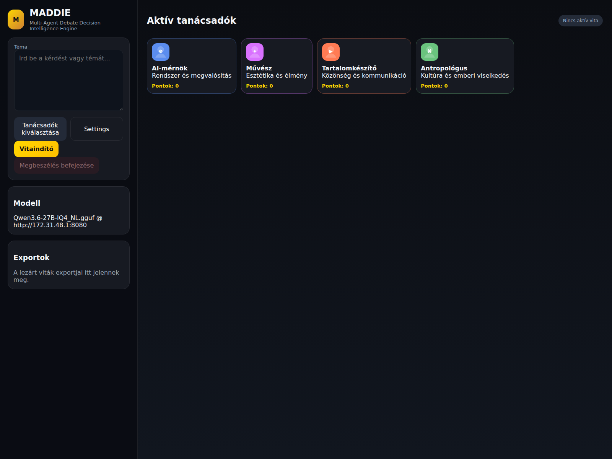
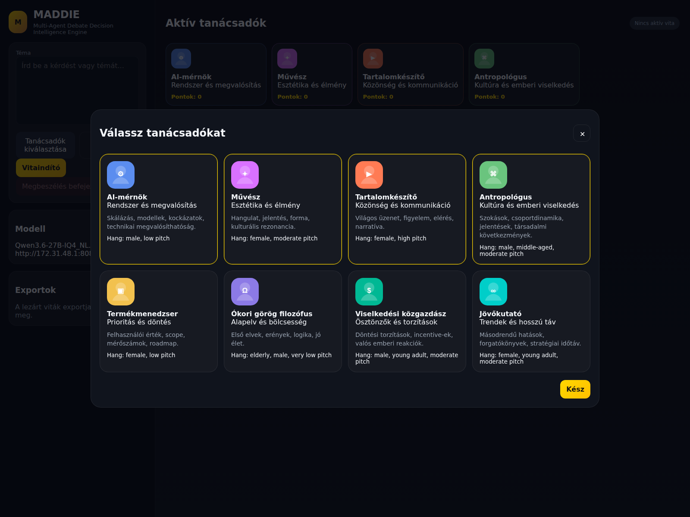
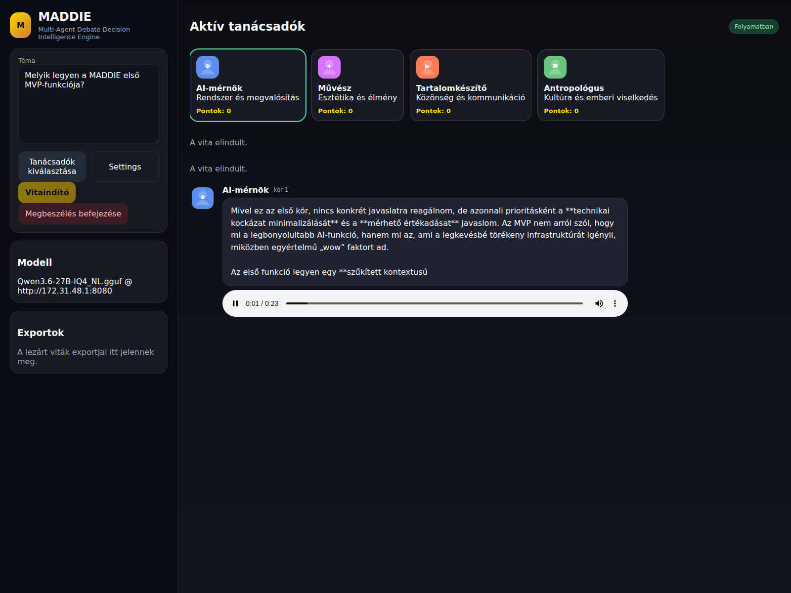

# MADDIE

Multi-Agent Debate Decision Intelligence Engine

MADDIE egy helyben futó, nyílt modellre épülő döntéstámogató vitaalkalmazás. A felhasználó megad egy fontos kérdést, kiválaszt több tanácsadót, majd nem egyetlen választ kap, hanem szerepalapú, egymásra reagáló megszólalásokat, hangos lejátszással, pontozással és végső összegzéssel.

A jelen implementáció:
- llama.cpp OpenAI-kompatibilis végpontot használ
- tanácsadónként OmniVoice hangot generál
- advisoronként szekvenciálisan halad: szöveg -> hang -> következő tanácsadó
- transcriptet, markdown összegzést és podcast WAV exportot készít

## Fő képességek

- 8 választható tanácsadó
- szerepalapú multi-agent vita
- hangos megszólalások OmniVoice segítségével
- kattintható pontozás advisoronként
- "Megbeszélés befejezése" lezáró logika
- végső összegzés:
  - áttekintés
  - tanácsadónkénti összegzés
  - konszenzusok
  - nézeteltérések
  - végső értékelések
  - javasolt következő lépések
- exportok:
  - transcript.txt
  - summary.md
  - podcast.wav

## Képernyőképek

### Fő nézet


A bal oldali vezérlőpanelből megadható a téma, megnyitható a tanácsadóválasztó és indítható a vita. Jobb oldalon az aktív tanácsadók és a beszélgetési tér jelenik meg.

### Tanácsadóválasztó modal


A modalban 8 különböző szerep közül lehet választani, mindegyik saját profillal, leírással és hangbeállítással. A kiválasztás vizuálisan kiemelve jelenik meg.

### Élő vita hangos lejátszással


A vita közben a megszólalás szövege azonnal megjelenik, majd alatta automatikusan elindul az advisor hangja. A következő tanácsadó csak az aktuális hang lejátszása után lép tovább.

## Hogyan működik

1. A felhasználó beír egy kérdést vagy témát.
2. Kiválaszt több tanácsadót.
3. Az első advisor megszólal a saját szerepe szerint.
4. A rendszer OmniVoice segítségével legenerálja és lejátssza a hangot.
5. A következő advisor csak a lejátszás után reagál.
6. A vita végén a rendszer összegzést és exportokat készít.

## Beépített tanácsadók

- AI-mérnök
- Művész
- Tartalomkészítő
- Antropológus
- Termékmenedzser
- Ókori görög filozófus
- Viselkedési közgazdász
- Jövőkutató

## Architektúra

- Frontend: HTML + CSS + vanilla JavaScript
- Backend: FastAPI
- LLM backend: llama.cpp OpenAI-compatible API
- TTS backend: OmniVoice HTTP service Dockerből, lokális worker fallbackkal
- Audio export: ffmpeg

Fő komponensek:
- `app/main.py` — API + statikus frontend kiszolgálás
- `app/debate_engine.py` — vita motor, szekvenciális advisor-vezérlés, összegzés, export
- `app/llm_client.py` — llama.cpp kliens, JSON-javító fallbackkal
- `app/tts_manager.py` — OmniVoice HTTP kliens + lokális worker fallback
- `services/omnivoice_api.py` — külön FastAPI-alapú OmniVoice szolgáltatás
- `scripts/omnivoice_worker.py` — lokális fallback worker
- `app/static/` — UI

## Követelmények

- Python 3.12+
- ffmpeg
- futó llama.cpp OpenAI-kompatibilis szerver
- Docker Desktop vagy helyi OmniVoice környezet

A jelenlegi alapértelmezett modell-végpont:
- `http://0.0.0.0:8080`

Megjegyzés:
- a kliensoldali hívásoknál a `0.0.0.0` automatikusan `127.0.0.1`-re normalizálódik, így Windows alatt is stabilan elérhető a helyi llama.cpp szerver

## Gyors indítás

Windows PowerShell:

```powershell
Set-Location D:\AI\MADDIE
.\run.ps1
```

Ha a 8000-es port foglalt, a script automatikusan a következő szabad portra lép és kiírja a használt URL-t.

Linux/macOS:

```bash
./run.sh
```

OmniVoice szolgáltatás Dockerből:

```powershell
docker compose up --build omnivoice
```

OmniVoice futás ellenőrzése

```powershell
curl http://127.0.0.1:8010/health

App:
- alapértelmezésben `http://127.0.0.1:8000`
- Windows alatt, portütközés esetén a `run.ps1` a következő szabad portot választja

## Konfiguráció

A fontos beállítások itt találhatók:
- `data/app_settings.json`
- `data/advisors.json`

Fontos mezők:
- `llama_base_url`
- `llama_model`
- `request_timeout_seconds`
- `opening_rounds`
- `closure_extra_turns`
- `omnivoice_enabled`
- `omnivoice_base_url`
- `omnivoice_language`
- `omnivoice_speed`
- `omnivoice_num_step`
- `omnivoice_device`

## Windows + Docker futtatás

1. Indítsd el a llama.cpp szervert úgy, hogy a hoston a `http://0.0.0.0:8080` címen figyeljen.
2. Indítsd el az OmniVoice szolgáltatást a gyökérkönyvtárból: `docker compose up --build omnivoice`.
3. Futtasd az alkalmazást PowerShellből: `.\run.ps1`.
4. Nyisd meg a PowerShellben kiírt helyi URL-t. Ha nincs portütközés, ez `http://127.0.0.1:8000` lesz.

Az OmniVoice konténer most alapból CUDA-s PyTorch builddel készül, `gpus: all`-lal indul, és `OMNIVOICE_DEVICE=auto` módban megpróbál GPU-ra állni. RTX 30-as kártyáknál a Docker image a `k2-fsa/OmniVoice` PR 71 refjét (`refs/pull/71/head`) telepíti, így az Ampere-optimalizált BF16/TF32/flex-attention inferenciaút elérhető.

Ha a Docker Desktop nem lát NVIDIA GPU-t, a szolgáltatás CPU-ra esik vissza. Ezt a `/health` végponton tudod ellenőrizni: `http://127.0.0.1:8010/health`.

Kézi felülírás példák PowerShellben:

```powershell
$env:OMNIVOICE_DEVICE = 'cuda'
docker compose up --build omnivoice
```

```powershell
$env:OMNIVOICE_DEVICE = 'cpu'
docker compose up --build omnivoice
```

## Hangklónozás

- A projektbe bemásolt hangminta itt van: `source/02_omnivoice/sajat_hang_v1-8sec_24k_mono.wav`
- A hangminta leirata itt van: `source/02_omnivoice/sajat_hang_v1-8sec.txt`
- Az `AI-mérnök` advisor alapból ezt a mintát használja `clone` módban.
- A többi advisor a Settings panelen átállítható `clone` módra ugyanazzal vagy más referenciahanggal.
- A backend relatív útvonal esetén a repo gyökerétől oldja fel a referenciahangot, majd feltölti azt az OmniVoice szolgáltatásnak.
- Ha a WAV mellett van megfelelő `.txt` sidecar leirat, azt a backend automatikusan felhasználja `ref_text`-ként, így nem kell minden megszólalásnál újratranszkribálni a mintahangot.

## Demo flow

Ajánlott demo kérdés:

```text
Mi legyen a MADDIE első MVP-funkciója?
```

Ajánlott advisor kombináció:
- Termékmenedzser
- AI-mérnök
- Tartalomkészítő
- Viselkedési közgazdász

Demo menet:
1. Nyisd meg a `Tanácsadók kiválasztása` modalt.
2. Válassz 3-4 szerepet.
3. Írd be a kérdést.
4. Kattints a `Vitaindító` gombra.
5. Figyeld meg, hogy a megszólalás után elindul az advisor hangja.
6. A hang vége után a következő advisor reagál.
7. A vita végén nyisd meg az exportokat.

## Exportok

A generált vitaanyagok ide kerülnek:

```text
app/generated/debates/<debate_id>/transcript.txt
app/generated/debates/<debate_id>/summary.md
app/generated/debates/<debate_id>/podcast.wav
```

A nyers advisor-audiók ide kerülnek:

```text
app/generated/audio/
```

## Ellenőrzött állapot

Ellenőrizve a helyi környezetben:
- llama.cpp `/v1/models` működik
- llama.cpp `/v1/chat/completions` működik
- OmniVoice worker működik
- a vita advisoronként szekvenciálisan halad
- a `continue` mechanizmus biztosítja, hogy a következő advisor csak a hang után következzen
- a summary JSON parse hibákra van javító fallback
- transcript / summary / podcast export elkészül

Példa sikeres teljes futás:
- debate id: `6aa45a02-b301-497d-83b6-29e570e8ec9f`

## Ismert megjegyzések

- Az OmniVoice első megszólalásnál lassabb lehet, különösen hideg indulás vagy modellcache-feltöltés után.
- A további megszólalások jellemzően jóval gyorsabbak.
- Ha a böngésző blokkolja az autoplay-t, a hang kézzel is elindítható; a vita a hang végén folytatódik.
- GitHub pushhoz külön GitHub-auth szükséges, ha a környezetben nincs konfigurált token vagy SSH-kulcs.

## Upstream inspiráció

A projekt ötleti és kutatási kiindulópontja:
- https://github.com/estherliu02/Multi-Agents-Debate

Megjegyzés:
- az upstream inkább research/CLI fókuszú
- a jelen webes MADDIE implementáció új UI + integrációs réteget épít rá llama.cpp és OmniVoice támogatással

## Projektstruktúra

```text
app/
  main.py
  debate_engine.py
  llm_client.py
  tts_manager.py
  static/
  generated/
data/
scripts/
docs/screenshots/
requirements.txt
run.sh
```

## Licenc

Tedd hozzá a kívánt licencet a publikus repo létrehozásakor, ha szükséges.
# MADDIE
